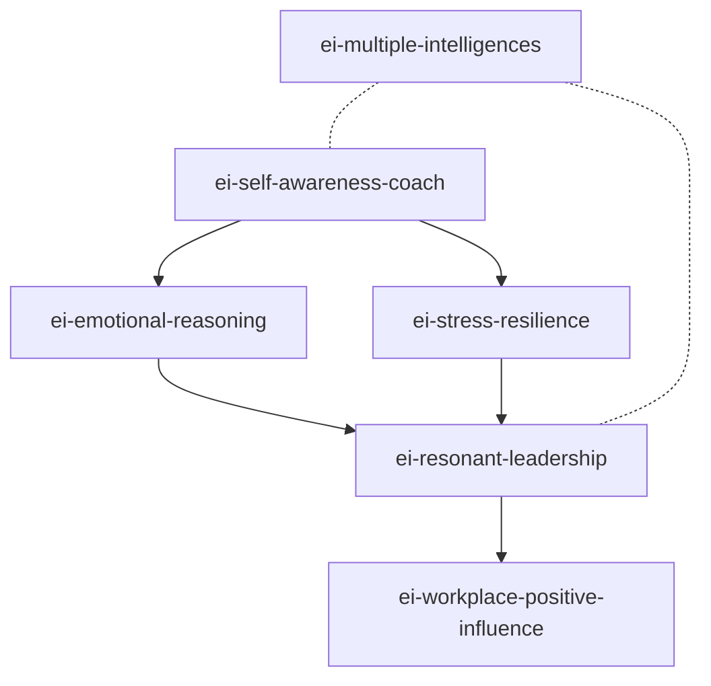

# EI 智能体 Skills 索引

> 由 cangjie-skill (book2skill) 蒸馏自六大 EI 核心著作
> 兼容 darwin-skill 进化引擎格式

## Skills 总览

| # | Skill | 来源 | 功能 | 触发关键词 |
|---|-------|------|------|-----------|
| 1 | **ei-self-awareness-coach** | 戈尔曼《情商》+ Mayer & Salovey | 情绪觉察与标记 | 情绪乱、不知道为什么反应、自我觉察 |
| 2 | **ei-resonant-leadership** | 戈尔曼《领导情商》 | 六种领导风格匹配 | 团队氛围差、领导力提升、带团队 |
| 3 | **ei-emotional-reasoning** | Mayer & Salovey MSCEIT + Genos | 情绪整合决策 | 怎么决定、感觉不对、理性和感性 |
| 4 | **ei-stress-resilience** | Bar-On EQ-i | 压力管理与韧性 | 压力大、焦虑、burnout、调节情绪 |
| 5 | **ei-workplace-positive-influence** | Genos 积极影响力 | 职场协作影响力 | 同事不配合、跨部门协作、怎么影响 |
| 6 | **ei-multiple-intelligences** | 加德纳《多元智能》 | 天赋优势识别 | 不知道擅长什么、发现天赋、转行 |

## Skill 依赖关系

## 与达尔文兼容性

每个 skill 目录均包含 `test-prompts.json`，遵循 darwin-skill 格式标准：
- 至少 4 个测试 prompt（含 happy path + 诱饵 + 边界场景）
- 可直接接入达尔文做自动评估与进化

## 使用方式

1. 将需要的 Skill 目录放入 AI 代理的 `.claude/skills/` 或等价路径
2. 在代理的配置中注册该 Skill
3. 代理会根据 trigger 条件自动调用对应 Skill
