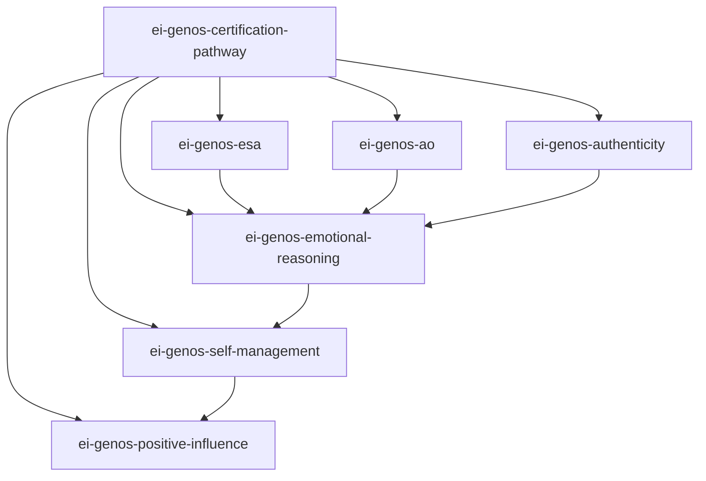

# Genos EI 认证 Skills 索引

> 基于 Ver.202505《情感智能核心认证手册》深度蒸馏
> 六维能力 × 行为指标 × 评估体系 × 认证路径
> 兼容 Claude Code / AI Agent 安装格式

## Skills 总览

| # | Skill | 维度 | 领域 | 核心功能 | 触发关键词 |
|---|-------|------|------|---------|-----------|
| 1 | **ei-genos-esa** | 情绪自我觉察 | 觉察 | 识别情绪变化、理解触发因素、情绪-绩效分析 | 情绪乱、不知道为什么反应、自我觉察 |
| 2 | **ei-genos-ao** | 他人情绪觉察 | 觉察 | 多模态情绪信号解码、共情确认、换位思考 | 搞不懂别人、团队氛围怪、共情 |
| 3 | **ei-genos-authenticity** | 真诚表达 | 行动 | 言行一致性、承诺管理、坦诚表达训练 | 不敢说真话、言行不一、装 |
| 4 | **ei-genos-emotional-reasoning** | 情绪推理 | 整合 | 情绪整合决策、事实×感受综合判断 | 不知道怎么决定、理性和感性 |
| 5 | **ei-genos-self-management** | 自我管理 | 管理 | 压力调节、精力管理、挫折恢复力 | 压力大、焦虑、burnout、调节情绪 |
| 6 | **ei-genos-positive-influence** | 积极影响力 | 领导 | 正面反馈、团队情绪问题解决、榜样领导力 | 同事不配合、团队士气低、反馈 |
| Ⓜ | **ei-genos-certification-pathway** | 元技能 | 总览 | 认证路径导航、维度匹配、发展路径规划 | 想了解认证、怎么成为EI教练 |

## 六维递进关系

| 阶段 | 维度 | 核心任务 | 频率目标 |
|------|------|---------|---------|
| 觉察 | 1. ESA → 2. AO | 从看见自己到看见他人 | 经常→总是 |
| 行动 | 3. Authenticity | 言行一致，建立信任 | 经常→总是 |
| 整合 | 4. ER | 理性×情绪综合判断 | 有时→经常 |
| 管理 | 5. SM | 压力下保持功能 | 有时→经常 |
| 领导 | 6. PI | 赋能他人，营造正向环境 | 偶尔→有时 |

## Skill 依赖关系



## 安装说明

### 方式一：手动安装（推荐）

1. 将需要的 Skill 目录（如 `ei-genos-esa`）复制到工作目录
2. 在 AI 代理配置中注册该 Skill
3. 根据触发关键词调用

### 方式二：批量安装（.tar.gz）

```bash
# 解压到当前目录
tar -xzf cert-skills.tar.gz
# 将需要的 skill 移到 .claude/skills/ 目录
mv ei-genos-esa /path/to/.claude/skills/
```

## 使用场景

- **EI 教练**：使用六维技能为客户提供结构化 EI 发展辅导
- **HR/OD**：使用认证路径技能为企业设计 EI 发展项目
- **管理者**：使用积极影响力技能提升团队领导力
- **个人发展**：使用自评 + 维度技能制定个人 EI 成长计划

## 认证级别与频率标准

| 认证级别 | 最低频率要求 | 能力要求 |
|---------|------------|---------|
| Foundation | 无需频率要求 | 理解六维模型 |
| Practitioner | 各维度 ≥ 有时(3) | 能完成360°反馈解读 |
| Senior Practitioner | 各维度 ≥ 经常(4) | 能辅导他人发展 |
| Master | 核心维度 ≥ 经常(4) | 能主导组织级EI项目 |
