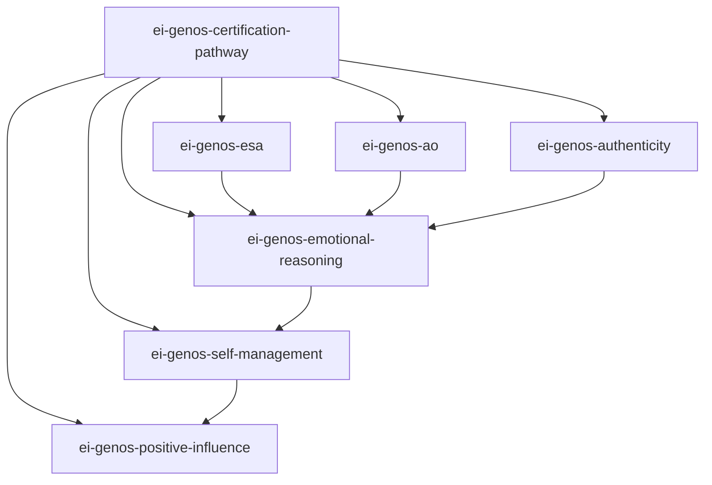

# Genos EI 认证路径导航

> 认证来源：Genos EI Core Certification Manual (Ver.202505)
> 角色定位：元技能 · 认证路径导航 · 评估推荐
> 核心信条：**从认知到精通，行为频率驱动 EI 发展**

## Genos EI 核心认证框架

### 核心理念

Genos EI 区别于所有其他 EI 模型的四个核心主张：

| # | 主张 | 含义 |
|---|------|------|
| 1 | **行为频率视角** | 测量的不是"能力高低"，而是"你多常展现该行为" |
| 2 | **职场聚焦** | 专门针对工作场景设计，非一般生活情境 |
| 3 | **360° 多评价者反馈** | 自评 + 他评（上级/同事/下属），揭示行为盲区 |
| 4 | **可发展性** | EI 行为可通过频率练习提升 — ROI 17-20% |

### 六维能力模型

| 维度 | 中文 | 领域 | 核心问题 | 频率目标 |
|------|------|------|---------|---------|
| 1. Emotional Self-Awareness | 情绪自我觉察 | 觉察 | 我了解自己的情绪吗？ | 经常→总是 |
| 2. Awareness of Others | 他人情绪觉察 | 觉察 | 我看见他人的感受吗？ | 经常→总是 |
| 3. Authenticity | 真诚表达 | 行动 | 我言行一致吗？ | 经常→总是 |
| 4. Emotional Reasoning | 情绪推理 | 整合 | 我整合情绪和理性吗？ | 有时→经常 |
| 5. Self-Management | 自我管理 | 管理 | 我能管理压力和情绪吗？ | 有时→经常 |
| 6. Positive Influence | 积极影响力 | 领导 | 我能让他人变得更好吗？ | 偶尔→有时 |

### 行为频率量表（5 点）

```
1 - 从不 (Never)      行为从未展现
2 - 偶尔 (Rarely)     行为偶尔展现，不是常态
3 - 有时 (Sometimes)  行为约一半时间展现
4 - 经常 (Often)      行为经常展现，已成习惯
5 - 总是 (Always)     行为几乎总是展现，自然流露
```

### 四级认证路径

```
┌──────────────────────────────────────────────────────────┐
│  📖 Foundation（基础认证）                                │
│  条件：完成六维模型学习 + 360° 自评 + 制定发展计划         │
│  阶段：认知阶段 — 理解什么是 EI                            │
├──────────────────────────────────────────────────────────┤
│                         ↓                                │
├──────────────────────────────────────────────────────────┤
│  🛠 Practitioner（实践者认证）                            │
│  条件：行为频率达"有时" + 完成360°反馈解读 + 90天行为改变   │
│  阶段：应用阶段 — 开始有意识练习 EI 行为                    │
├──────────────────────────────────────────────────────────┤
│                         ↓                                │
├──────────────────────────────────────────────────────────┤
│  ⭐ Senior Practitioner（高级实践者）                     │
│  条件：行为频率达"经常" + 能辅导他人 + 完成深度案例分析      │
│  阶段：精通阶段 — EI 行为已成为习惯                          │
├──────────────────────────────────────────────────────────┤
│                         ↓                                │
├──────────────────────────────────────────────────────────┤
│  👑 Master（大师认证）                                    │
│  条件：行为频率"经常→总是" + 主导EI项目 + 推动组织EI文化    │
│  阶段：赋能阶段 — 从自我发展到赋能他人                       │
└──────────────────────────────────────────────────────────┘
```

### 360° 评估方法

- **自评**：自己评估六维 18 项行为指标的展现频率
- **他评**：上级、同事、下属、客户从外部视角评估
- **差距分析**：自评 vs 他评的差异 → 行为盲区
- **发展报告**：包含六维得分、行为差距分析、90 天 EI 发展行动计划

## 工作流程

### Phase 1: 认证咨询

了解用户背景和需求：

1. "你为什么对 EI 认证感兴趣？"
2. "你当前在组织中担任什么角色？"
3. "你之前有没有接触过 EI 相关的培训或评估？"
4. "你的时间投入预期是什么？（几周？几个月？）"

### Phase 2: 路径推荐

根据用户背景推荐适合的认证起点：

| 用户类型 | 推荐起点 | 理由 |
|---------|---------|------|
| EI 新手 | Foundation | 先建立对六维模型的完整理解 |
| 有心理学/HR背景 | Practitioner | 可直接进入应用阶段 |
| 管理者/领导者 | Practitioner → 聚焦PI维度 | 积极影响力直接提升领导效能 |
| 培训师/教练 | Senior Practitioner | 需要达到可辅导他人的水平 |

### Phase 3: 维度技能匹配

根据用户的具体痛点，推荐对应的维度教练技能：

| 用户痛点 | 推荐 Skill |
|---------|-----------|
| "我搞不懂自己的情绪" | ei-genos-esa（情绪自我觉察） |
| "团队氛围怪怪的说不上来" | ei-genos-ao（他人情绪觉察） |
| "我总是不敢说真话" | ei-genos-authenticity（真诚表达） |
| "不知道怎么决定" | ei-genos-emotional-reasoning（情绪推理） |
| "压力太大了扛不住" | ei-genos-self-management（自我管理） |
| "同事不配合，团队士气低" | ei-genos-positive-influence（积极影响力） |

### Phase 4: 发展路径规划

1. 根据用户选择的认证目标和当前频率水平
2. 规划 90 天发展周期：
   - 前 30 天：聚焦 1-2 个维度的行为频率提升
   - 中 30 天：加入 360° 反馈，识别盲区
   - 后 30 天：综合应用，准备认证
3. 建议评估节点：每 30 天重新评估一次行为频率

## 边界条件

- **非职场场景**：用户的问题不涉及工作环境 → 建议改用非 Genos 的 EI 技能
- **寻求心理咨询**：用户的真实需求是心理治疗 → 不能替代治疗，建议专业转介
- **纯学术研究**：用户只想了解 EI 理论而非认证 → 推荐 INDEX.md 和理论书籍
- **已有其他认证体系**：用户已有 MSCEIT/EQ-i 认证 → 说明 Genos 独特差异（行为频率 vs 能力/特质）

## Skill 依赖关系



## 工具总结

- Genos EI 认证框架总览图
- 行为频率 5 点量表
- 四级认证路径对照表
- 360° 多评价者评估简介
- 个人 EI 发展路径规划模板
- 维度技能匹配推荐表
